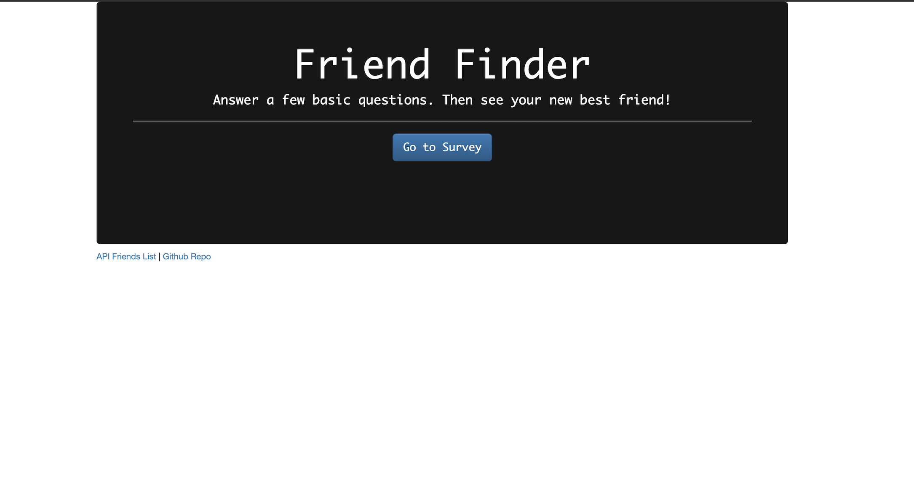
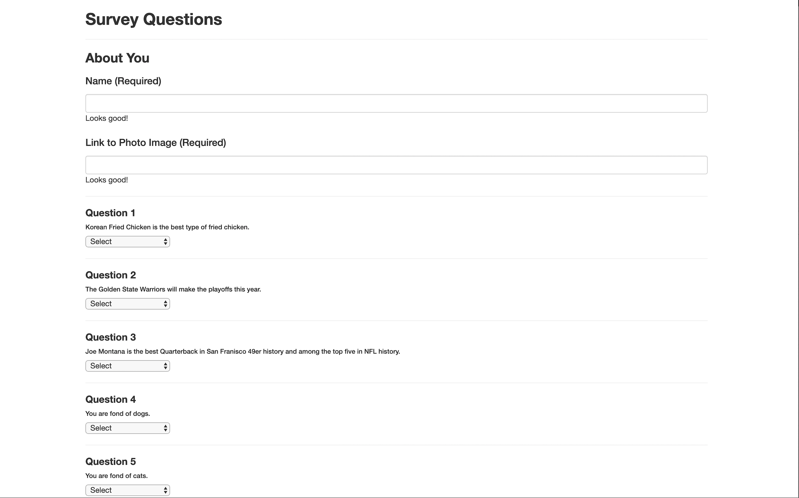
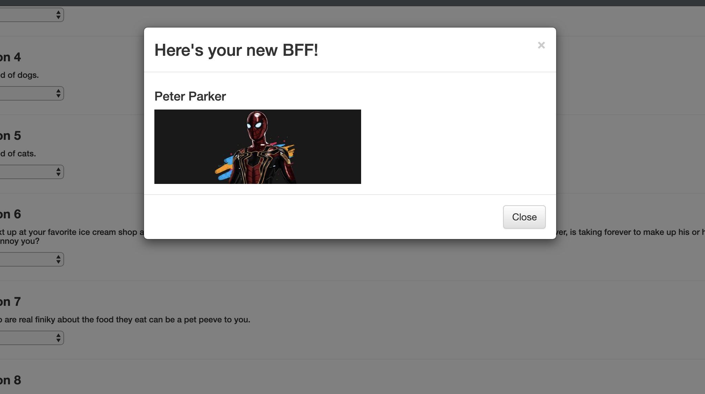
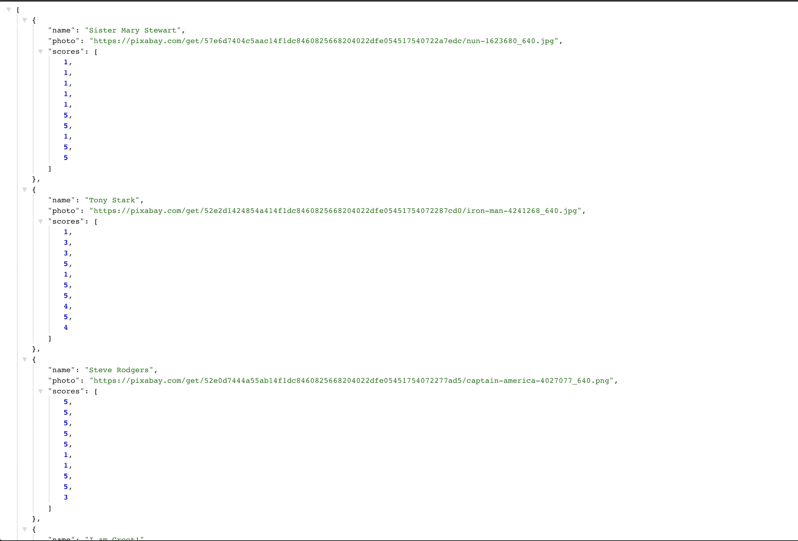

# Friend-Finder
Node and Express Servers

## Screen Shots:





## Link to full app demo on Heroku:
https://bestie-finder.herokuapp.com/

## User Guide:
1. Click the go to survey button.
2. Enter your name.
3. Enter a link to your photo (Github, Linkedin or Facebook for example).
4. Answer all 10 survey questions.
5. See your new BFF!


## About the project:
In this activity, we were tasked in building a compatibility-based "FriendFinder" application -- basically a dating app. This full-stack site will take in results from a user's servey, then compare their answers with those from other users. The app will then display the name and picture of the user with the best overall match.  We used npm express to hadle the routing.

## MVP Objectives:
1. The survey should have 10 questions of our choosing. Each answer should be on a scale of 1 to 5 based on how much the user agrees or disagrees with a question.

2. The server.js file should require the basic npm packages we've used in class: express, body-parser and path.

3. The htmlRoutes.js file should include two routes:
  a. A GET Route to /survey which should display the survey page.
  b. A default, catch-all route that leads to home.html which displays the home page.

4. The apiRoutes.js file should contain two routes:
  a. A GET route with the url /api/friends. This will be used to display a JSON of all possible friends.
  b. A POST routes /api/friends. This will be used to handle incoming survey results. This route will also be used to handle the compatibility logic.

5. I saved the application's data inside of app/data/friends.js as an array of objects. Each of these objects should roughly follow the format below.
```
{
  "name":"Ahmed",
  "photo":"https://media.licdn.com/mpr/mpr/shrinknp_400_400/p/6/005/064/1bd/3435aa3.jpg",
  "scores":[
      5,
      1,
      4,
      4,
      5,
      1,
      2,
      5,
      4,
      1
    ]
}
```

6. Determine the user's most compatible friend using the following as a guide:
  * I converted each user's results into a simple array of numbers (ex: [5, 1, 4, 4, 5, 1, 2, 5, 4, 1]).
  * With that done, I compared the difference between current user's scores against those from other users, question by question. I added up the differences to calculate the totalDifference.
    * Example:
      * User 1: [5, 1, 4, 4, 5, 1, 2, 5, 4, 1]
      * User 2: [3, 2, 6, 4, 5, 1, 2, 5, 4, 1]
    * Total Difference: 2 + 1 + 2 = 5

  * I used the absolute value of the differences. Put another way: no negative solutions! Your app should calculate both 5-3 and 3-5 as 2, and so on.
  * The closest match will be the user with the least amount of difference.

7. When the current user's most compatible friend is determined, the result is displayed as a modal pop-up. The modal displays both the name and picture of the closest match.

## Stretch Goals:
* Working on form validation
* Will try to make the matching algo weighted for certain questions
  
## Techology Stack:
  * Node.js
  * JavaScript
  * npm express
  * npm body-parser
  * npm path
  * Heroku

## Methodology:
I followed closely the class activities in Star Wars and Hot New Restaurant. They helped guide me especially in setting up the routes. 

For the logic in comparing user's scores against the data in the friends file, I created a nested for-loop. The outer loop looped over the all the objects in the friends db while the inner loop looped over each of those objects' arrays of scores. While doing the inner-loop, the code finds the absolute value difference between each array in the friends db against the user's scores array and adds each total to a counter (accumulator). Each accumulator score is them compared against the one before it and the counter score with the lowest absolute value difference becomes the user's new BFF. The algo resets for each user (details in the code snippit below).

## Problems That I Overcame:

One problem was getting the user data from the survey into the friends db properly. I overcame this by using request.body and request.body.scores after going through npm body-parser's docs.

I also experienced many bugs with regards to the code for comparing the user scores with the scores of the fixed data in friends. Initially, my code was trying to compare the user scores array against the entire array of fixed data as opposed to each of the fixed data scores arrays. I solved this by implement a nested for-loop. The details are below in code snippets.

## Problems Still Facing:

Form validation. Trying to implement a method where the user is notified if she doesn't answer all of thje questions.


## Code Snippets:
Logic for comparing the user's scores array against all the fixedData arrays.
```
var bffIndex = 0;
    var defaultBeta = 100;
    // First for-loop loops over all the arrays in friends. 
    for (var i = 0; i < fixedData.length; i++) {
      console.log(fixedData[i].scores);
      // Setting a counter equal to 0. 
      var accumulator = 0;
      // Second four-loop compares the absolute difference in scores between every array in friends vs. the user's score and added the total difference to the accumulator. 
      for (var j = 0; j < fixedData[i].scores.length; j++) {
        var beta = (Math.abs(surveyScores[j] - fixedData[i].scores[j]));
        accumulator += beta;
      };
      // If the accumulator score is less than the default beta, which it always will be, the the default beta becomes the accumulator. Basucally this sets up the comparison loop to go from one friend to the other comparing against the user's score. 
      if (accumulator < defaultBeta) {
        bffIndex = i;
        defaultBeta = accumulator;
      };
    };
```


## Link to my Portfolio Page on Github where this app is listed in the portfolio section.

https://olisun.github.io/Updated-Portfolio-Page/

## You can also reach me on LinkedIn.
https://www.linkedin.com/in/oliver-sun-4b6baba/
